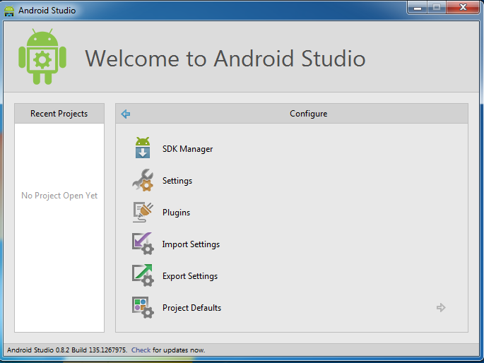
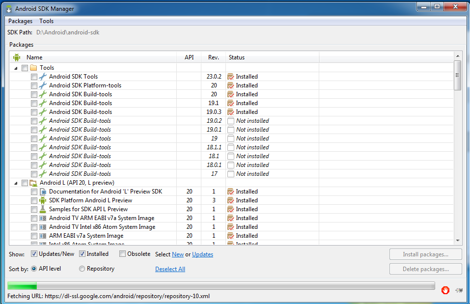

Hi and welcome to my blog. In this blog post I am going to describe how to get start on developing applications on the Android platform using Android Studio.

##Introductions
###What is Android Studio?
Android studio is an integrated development environment(IDE) based on IntelliJ IDEA that will be the next official IDE for Android Development. The IDE is currently in the beta release at the time of this post and may require update or reinstallation once it is stable.

You may develop phone/tablet apps, TV apps, Glass apps and Wear apps using the Android Studio.

###Installation
First, you will need a development environment with Java Development Kit(JDK) version 6 or 7 installed. You may download it from [here](http://www.oracle.com/technetwork/java/javase/downloads/index-jsp-138363.html#JDK7). 

Next, you will need to download the Android Studio Bundle [here](http://developer.android.com/sdk/installing/studio.html#download) (recommended). Once the installation is completed, open up the IDE and configure the SDK.

You may want to download and install all the tools provided in case you may need them in the future. This process may take awhile so let's grab a cup of coffee.

####Optional
You may also want to install [Genymotion](http://www.genymotion.com/), a virtual machine for Android based on virtual box as an alternative to Android Virtual Device or AVD (will be covered next).

Once everything is installed you may start to develop your first android app!
