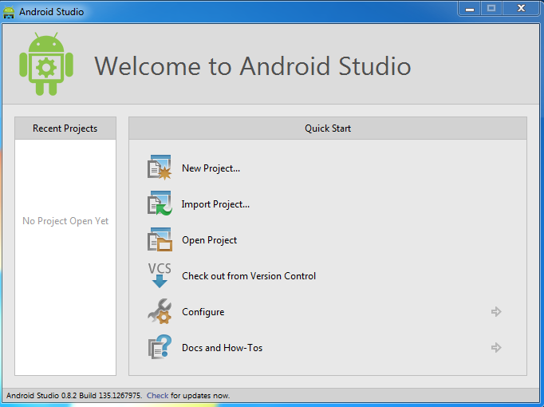

This post is part of the Getting Started with Android Application Development - Android Studio Edition. In the [previous post](http://blog.adrianchia.com/getting-started-with-android-development/) we discussed how to setup our first Android Virtual Device (AVD). In this post we are going to create our first application using Android Studio.

## First Application Development

1. Open Android Studio and click on *New project...*

2. Give your Application a name, ths name is what we will see on the phone as well as on Google Play Store if you published it at the end of the development.

3. We will leave the rest of the configuration on this page as is for now and click *Next*.

4. Select the type of Android Devices we are going to build against. (e.g. Phone/Tablet, TV, Wear or Glass). We will select Phone/Tablet for now and click *Next*

5. Add an Activity to your application. An activity is an Android components that display the screen and/or interact with the application users. see [here](https://developer.android.com/guide/components/activities.html) for more details. We will add a Blank Activity and click *Next*.

6. Give your activity a name, we will leave this page as default for now and click *finish*

7. Wait for Android Studio to setup our project. Once the project is setup we will see our project like this. We will talk about the project structure in detail in upcoming post.

8. Click on the green Play button to build our application. You may select a running device (a phone, a running AVD) or launch an emulator. We will select the AVD that we created in the previous post.

Wait for the AVD to boot up. Once it is booted up and the application is installed we will see our application running. Yay!

Play around with Android Studio, AVD and the application that you created. Now that you have your first application running. Let's build something cool!
