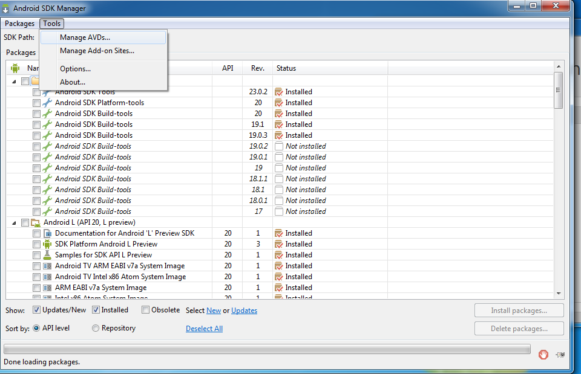
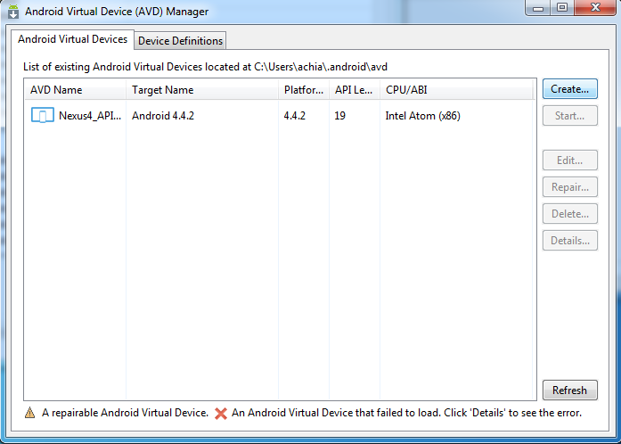

This post is part of the Getting Started with Android Application Development - Android Studio Edition. In [part 1](http://blog.adrianchia.com/getting-started-with-android-application-development/) we discussed how to install Android Studio and SDK required for Android application development. In this post we are going to describe how to setup Android Virtual Devices, or AVD to emulate the targeted environments. This part is optional if you decided to use your actual devices or a different emulation environment like [Genymotion](http://www.genymotion.com/).

## Creating Android Virtual Device (AVD)

1. Open up Android Studio then click on Configure to open the SDK Manager. This step is also described in the previous post [here](http://blog.adrianchia.com/getting-started-with-android-application-development/).

2. Click on Tools from the menu bar and select "Manage AVDs"

    
        Mac and Linux Users may see different UIs.

3. On Android Virtual Device (AVD) Manager, click on "Create" to create a new AVD.

 The folowing only covers the key steps to configure your first AVD.

 * Give your AVD a meaningful name. For example, **Nexus4\_API19\_ARM** for Nexus 4 emulator running on Android API 19 in ARM based CPU or **HTCOne\_GAPI15\_x86** for HTC One running on Google API level 15 in x86 based CPU).
 * Select the device we are going to build with.
 
            If your targeted device is not here (i.e. non-Nexus device) you may search online on your target device should be configured with.
            
 * Select the targeted Android version to build with, e.g. **Android 4.0 - API 14**. The difference between regular APIs and Google APIs is that the Google APIs include additional Google specific APIs like the Google Maps API.
 
 * Select the targeted CPU/ABI environment. e.g. ARM, Intel x86 or MIPS. 

 * Select the Skin. e.g. Skin with Hardware control
 
 * Add Camera if you want to your AVD to have Camera, you may select emulated camera or actual camera installed on your Desktop / Laptop.
 
 * Enable Snapshot to speed up the next start up of the AVD or enable Use Host GPU to speed up the graphics. A detail on how this works is described [here](http://developer.android.com/tools/devices/emulator.html). These options may not be selected at the same time.
 
 Once everything is configured click *OK* to save your first AVD.
 
In the next part of this series we are going to build our first application.
